# Spaceduck 🚀🦆

[](https://img.shields.io/github/stars/pineapplegiant/spaceduck-theme?style=social)
[](https://img.shields.io/github/forks/pineapplegiant/spaceduck-theme?style=social)
[](http://opensource.org/licenses/MIT)
[](https://img.shields.io/github/repo-size/pineapplegiant/spaceduck-theme)
[](https://img.shields.io/badge/madewith-nvim%E2%9D%A4%EF%B8%8F-red)

<center>
  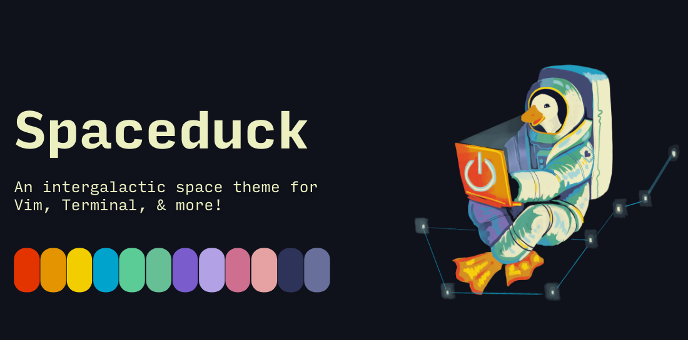
</center>

<center>
  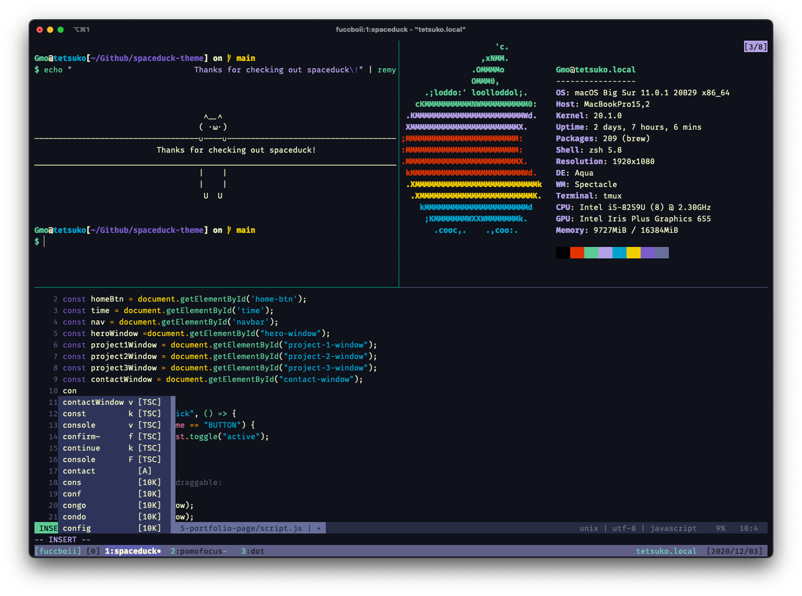
</center>

# Table of Contents
- [Inspiration 💭](#inspiration-💭)
- [Colors Palette 🎨](#colors-palette-🎨)
  * [Base Colors](#base-colors)
  * [Special Colors](#special-colors)
  * [Coloration Colors](#coloration-colors)
- [Install 💾](#install-💾)
  * [Vim and Neovim](#vim-and-neovim)
  * [Iterm2](#iterm2)
  * [Terminal.app MacOS](#terminalapp-macos)
  * [Slack](#slack)
- [Troubleshooting 🔧](#troubleshooting)
  * [True color](#true-color)
  * [Colors don't look right](#colors-don-t-look-right)
- [Credits 💳](#credits-💳)
- [Contribute 🙏](#contribute-🙏)

# Inspiration 💭

This theme was inspired from my incessant desire to feel like I'm in space when I stare at a computer. 
"Spaceduck" takes its name from my love of [duck dodgers](https://m.media-amazon.com/images/M/MV5BNDY2YjgyZGMtMWY2Zi00ZmQ5LTg0YjgtNjYyMGNkMTMzNWU1XkEyXkFqcGdeQXVyMzM4NjcxOTc@._V1_.jpg) as a kid.

If it looks ugly it's because I don't know what I'm doing pls help. If it's the sexiest thing you've ever seen, well then uhm.. you're welcome 😎

# Colors Palette

## Base Colors

          | Palette          | Hex       | HSV/HSB        | RGB             | cterm/256 | 
---------------------------------------------------------| ---------------- | --------- | -------------- | --------------- | ---------- | 
                          | Red              | `#e33400` | `14,100,89`    | `227, 52, 0`    | `166`      | 
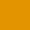                    | Orange           | `#e39400` | `39,100,89`    | `227, 148, 0`   | `172`      | 
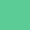                      | Green            | `#5ccc96` | `151,55,80`    | `92, 204, 150`  | `78`       | 
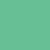                    | Green2           | `#67bf95` | `151,46,75`    | `103, 191, 149` | `72`       | 
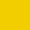                    | Yellow           | `#f2ce00` | `51,100,95`    | `242, 206, 0`   | `220`      | 
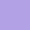                    | Purple           | `#b3a1e6` | `256,30,90`    | `179, 161, 230` | `146`      | 
                  | Purple2          | `#7a5ccc` | `256,55,80`    | `122, 92, 204`  | `98`       | 
           | Dark Purple      | `#2e3459` | `232,48,35`    | `46, 52, 89`    | `236`      | 
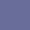         | Dark Purple2     | `#686f9a` | `232,32,60`    | `104, 111, 154` | `60`       | 
                        | Cyan             | `#00a3cc` | `192,100,80`   | `0, 163, 204`   | `38`       | 
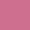                   | Magenta          | `#ce6f8f` | `340,46,81`    | `206, 111, 143` | `168`      | 
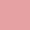                        | Pink             | `#e6a1a3` | `358,30,90`    | `230, 161, 163` | `181`      | 

## Special Colors
|           | Palette          | Hex       | HSV/HSB        | RGB             | cterm/256 |
| ---------------------------------------------------------| ---------------- | --------- | -------------- | --------------- | ----------|
|             | Background       | `#0f111b` | `230,44,11`    | `15, 17, 27`    | `233`     |
| 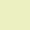            | Foreground       | `#ecf0c1` | `65,20,94`     | `236, 240, 193` | `255`     |
|  | Visual Selection | `#272c42` | `229,41,26`    | `39, 44, 66`    | `236`     |
|            | Cursor Line      | `#16172d` | `237,51,18`    | `22, 23, 45`    | `234`     |
|                   | Comment          | `#1f2440` | `231,52,25`    | `31, 36, 64`    | `235`     |
|                     | Search           | `#114fd6` | `221,92,84`    | `17, 79, 214`   | `26`      |

## Coloration Colors                                                                                                                       
|           | Palette          | Hex       | HSV/HSB        | RGB             | cterm/256 |
| ---------------------------------------------------------| ---------------- | --------- | -------------- | --------------- | ----------|
|                         | Grey             | `#818596` | `229,14,59`    | `129, 133, 150` | `102`     |
|                      | Grey 2           | `#c1c3cc` | `229,5,80`     | `193, 195, 204` | `251`     |
|                  | Pure White       | `#ffffff` | `0,0,100`      | `255, 255, 255` | `15`      | 
|                  | Pure Black       | `#000000` | `0,0,0`        | `0, 0, 0`       | `0`       | 


# Install 💾

If using Vim/Neovim I recommend installing the [vim-polyglot](https://github.com/sheerun/vim-polyglot) plugin for improved syntax highlighting:

`Plug 'sheerun/vim-polyglot'`

## Vim and Neovim

Install the plugin with whatever plugin manager you use:

  `Plug 'pineapplegiant/spaceduck'`

Add this to your vimrc/init.vim configuration file:

```vimscript
    if exists('+termguicolors')
      let &t_8f = "\<Esc>[38;2;%lu;%lu;%lum"
      let &t_8b = "\<Esc>[48;2;%lu;%lu;%lum"
      set termguicolors
    endif

   colorscheme spaceduck
```

* [Airline](https://github.com/vim-airline/vim-airline)

```vimscript
  let g:airline_theme = 'spaceduck'
```

* [Lightline](https://github.com/itchyny/lightline.vim)

<center>
  
  
  
  
</center>

```vimscript
    let g:lightline = {
          \ 'colorscheme': 'spaceduck',
          \ }
```

Don't be afraid of the vim documentation either for more information, like for manual installs! I know I am:
`:h colorscheme`


## Iterm2

<center>
  
</center>

To get the theme into Iterm, download the spaceduck.itermcolors file and [import it into your settings](https://iterm2colorschemes.com/).

You can curl it if you wanna be cool?

```bash
  curl -O "https://raw.githubusercontent.com/pineapplegiant/spaceduck/main/spaceduck.itermcolors"
```

## Terminal.app MacOS

<center>
  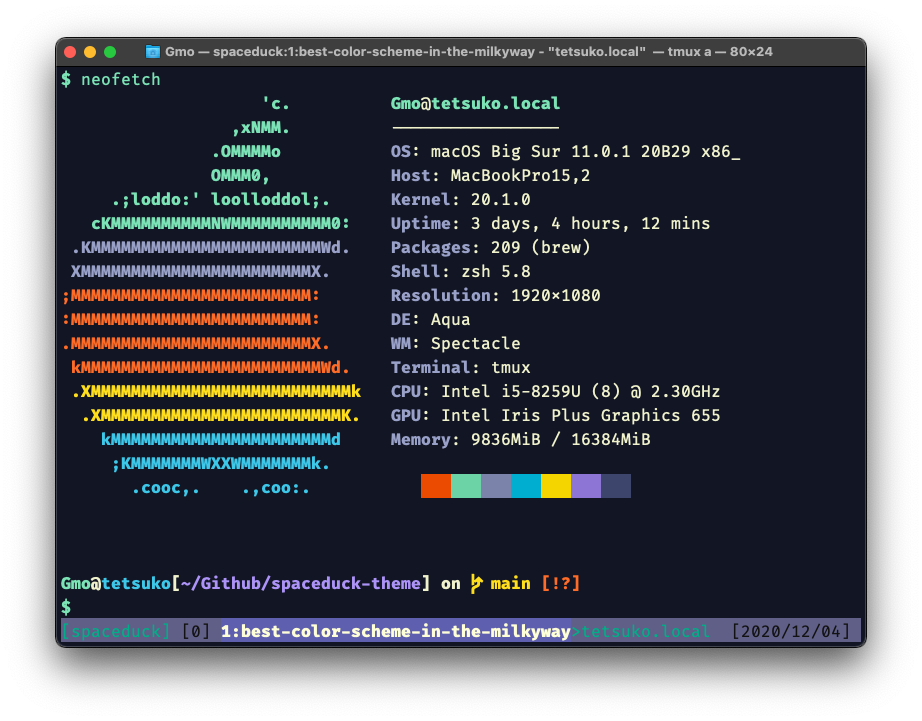
</center>

To get the theme into the Mac Terminal app, download the spaceduck.terminal file and import it into your settings.

You can curl it if you wanna be cool too!?

```bash
  curl -O "https://raw.githubusercontent.com/pineapplegiant/spaceduck/main/spaceduck.terminal"
```

## Slack

- Go to User Menu > Preferences > Sidebar Theme
- In the bottom of the window, look for a "customize your theme and share it with others" link
- Copy and paste the values below:
  - `#0f111b,#7A5CCC,#7A5CCC,#ffffff,#16172D,#ecf0c1,#5CCC96,#00A3CC,#0f111b,#ecf0c1`


# Troubleshooting 🔧

## True color

Make sure you are using a terminal emulator that supports `truecolor`. Read more about this [here](https://gist.github.com/XVilka/8346728).

## Colors don't look right

If you are running `vim` within `tmux`, you may run into some `truecolor` issues.

To fix, add this to you `tmux.conf`:
```tmux
set -g terminal-overrides ',xterm-256color:Tc'
set -g default-terminal "tmux-256color"
set -as terminal-overrides ',xterm*:sitm=\E[3m'
```

And in your `.bash_profile or .zshrc`:
```bash
  export TERM="xterm-256color"
```

# Credits 💳

* [Iceberg](https://cocopon.github.io/iceberg.vim/) - Gave me the blueprint for developing a [lovely colorscheme](https://speakerdeck.com/cocopon/creating-your-lovely-color-scheme).
* [Hallski's spacedust theme](https://github.com/hallski/spacedust-theme) - first theme to inspire me with space waaaay back when.
* [Rigel](https://github.com/Rigellute/rigel) - Showed me the ways of using Estilo to manage colors & that sexy themes can exist.


# Contribute 🙏

If you'd like to contribute please reach out! I don't know what I'm doing.
