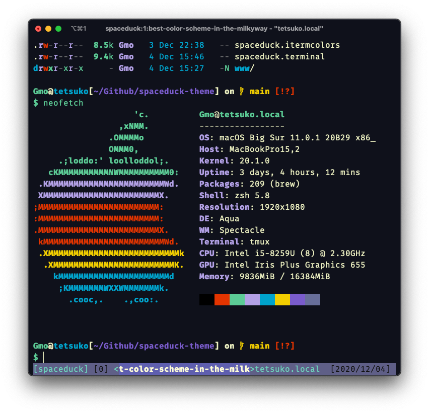

# Terminal Installation 🖥

[Link to base dir README](../README.md)

<center>
  
</center>


## Table of Contents

* [Iterm2](#iterm2)
* [Terminal.app MacOS](#terminalapp-macos)
* [Alacritty](#alacritty)
* [Kitty](#kitty)
* [Windows Terminal](#windowsterminal)

## Iterm2


To get the theme into Iterm, download the spaceduck.itermcolors file and [import it into your settings](https://iterm2colorschemes.com/).

You can curl it if you wanna be cool?

```bash
  curl -O "https://raw.githubusercontent.com/pineapplegiant/spaceduck/main/term/spaceduck.itermcolors"
```

## Terminal.app MacOS

To get the theme into the Mac Terminal app, download the spaceduck.terminal file and import it into your settings.

You can curl it if you wanna be cool too!?

```bash
  curl -O "https://raw.githubusercontent.com/pineapplegiant/spaceduck/main/term/spaceduck.terminal"
```
**Side note**: (As of 2020-12-09) The MacOSX terminal app does not support true color in vim, so it's gonna be mad ugly.


## Alacritty

Color theme is in the `spaceduck.yml` file or you can copy it here!

```YAML
# Space Duck
colors:
  # Default colors
  primary:
    background: '#0f111b'
    foreground: '#ecf0c1'
  # Normal colors
  normal:
    black:   '#000000'
    red:     '#e33400'
    green:   '#5ccc96'
    yellow:  '#b3a1e6'
    blue:    '#00a3cc'
    magenta: '#f2ce00'
    cyan:    '#7a5ccc'
    white:   '#686f9a'

  # Bright colors
  bright:
    black:   '#686f9a'
    red:     '#e33400'
    green:   '#5ccc96'
    yellow:  '#b3a1e6'
    blue:    '#00a3cc'
    magenta: '#f2ce00'
    cyan:    '#7a5ccc'
    white:   '#f0f1ce'
```

## Kitty

Color theme is in the `spaceduck.conf` file or you can copy it here!

```
background #0f111b
foreground #ecf0c1
cursor #ecf0c1
selection_background #686f9a
color0 #000000
color8 #686f9a
color1 #e33400
color9 #e33400
color2 #5ccc96
color10 #5ccc96
color3 #b3a1e6
color11 #b3a1e6
color4 #00a3cc
color12 #00a3cc
color5 #f2ce00
color13 #f2ce00
color6 #7a5ccc
color14 #7a5ccc
color7 #686f9a
color15 #f0f1ce
selection_foreground #ffffff
```

## Windows Terminal

Color theme is in the `spaceduck_windowsterminal.json` file or you can copy it here! Put it in your Windows Terminal settings.json

```JSON
"schemes": [
        {
            "name": "SpaceDuck",
            "foreground": "#ecf0c1",
            "background": "#0f111b",
            "black": "#000000",
            "red": "#e33400",
            "green": "#5ccc96",
            "yellow": "#b3a1e6",
            "blue": "#00a3cc",
            "purple": "#f2ce00",
            "cyan": "#7a5ccc",
            "white": "#686f9a",
            "brightBlack": "#686f9a",
            "brightRed": "#e33400",
            "brightGreen": "#5ccc96",
            "brightYellow": "#b3a1e6",
            "brightBlue": "#00a3cc",
            "brightPurple": "#f2ce00",
            "brightCyan": "#7a5ccc",
            "brightWhite": "#f0f1ce"
        }
```